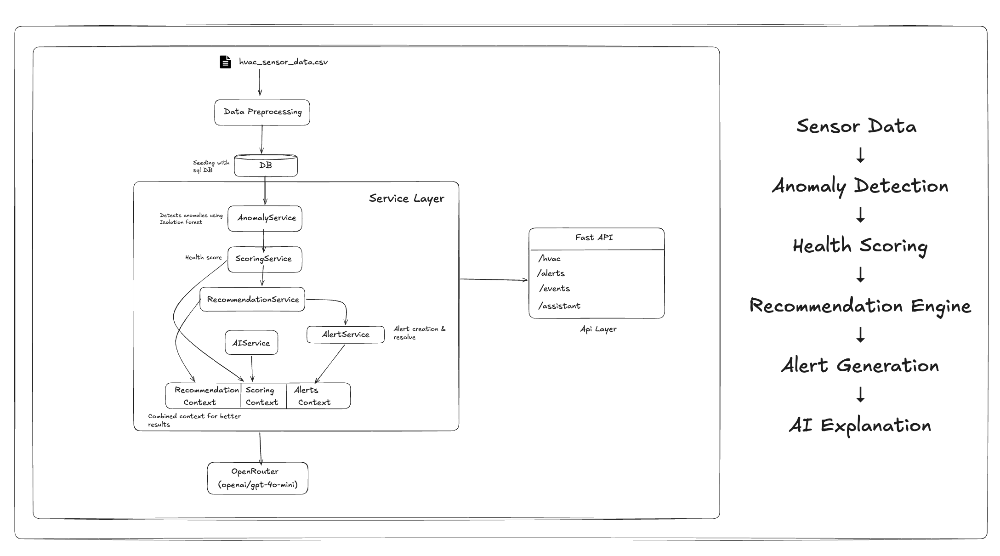
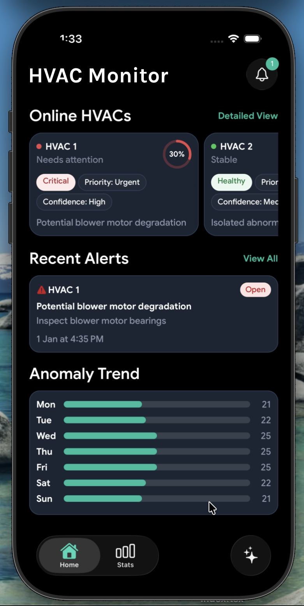
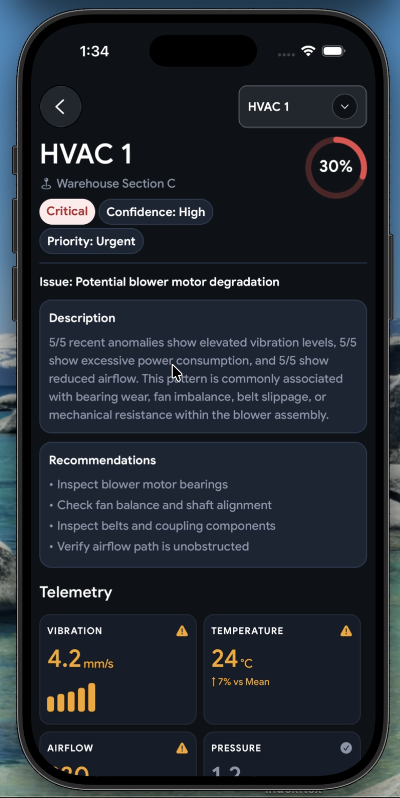
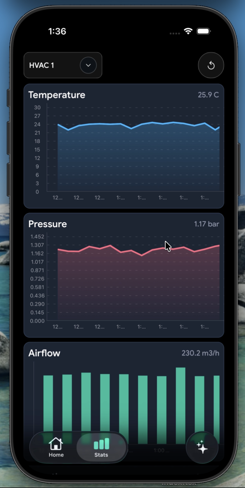
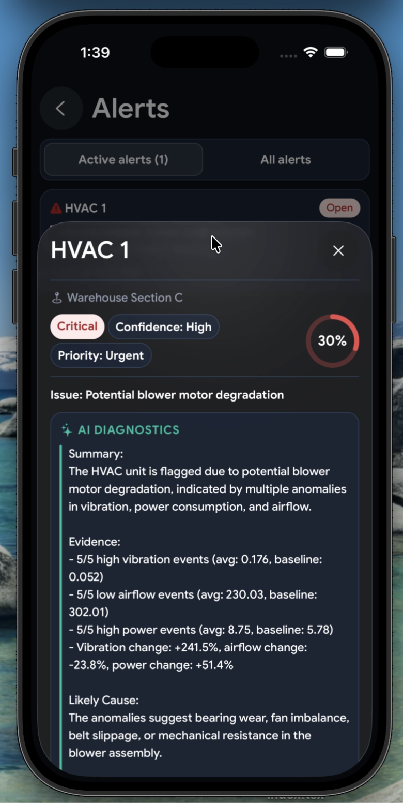
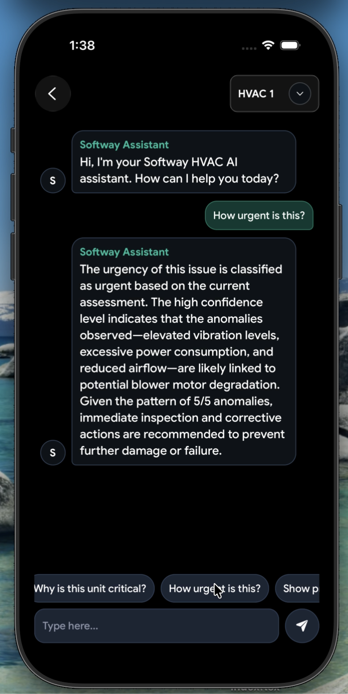

# HVAC Monitoring System

AI-powered HVAC monitoring platform built with React Native and FastAPI.

## Overview

This project monitors HVAC units using sensor telemetry data and provides anomaly detection, health scoring, maintenance recommendations, alert management, and an AI-powered maintenance assistant.

The goal is to help technicians identify issues early, prioritize maintenance activities, and gain actionable insights from operational data and avoid false alerts.

## Features

### Dashboard

- Health score monitoring
- Severity, priority, and confidence indicators
- HVAC overview cards
- Detailed unit inspection

### Detailed HVAC View

- Sensor telemetry data
- Health metrics
- Issue descriptions
- Maintenance recommendations

### Alerts

- Automatic alert generation
- Severity-based prioritization
- AI-generated diagnostics
- Alert resolution workflow

### Statistics & Analytics

- Anomaly trend visualization
- Sensor metric charts
- Cross-unit comparisons
- Historical telemetry analysis

### AI Assistant

- Natural language HVAC troubleshooting
- Context-aware maintenance guidance
- Recommendations grounded in system data
- Conversational interface

### Home Screen Widgets

- Quick HVAC health monitoring
- At-a-glance system status

---

## Architecture

### Backend

FastAPI service-oriented architecture.

Sensor Data
→ Preprocessing
→ SQLite Database
→ Anomaly Detection
→ Health Scoring
→ Recommendations
→ Alerts
→ AI Assistant

### Core Services

- PreprocessingService
- AnomalyService
- ScoringService
- RecommendationService
- AlertService
- StatsService
- AIService

### AI Architecture

The AI assistant gathers context from:

- HVAC health scores
- Maintenance recommendations
- Active alerts

This context is combined into a grounded prompt and sent to OpenRouter, allowing the assistant to provide HVAC-specific guidance based on actual system data.

---

## Machine Learning Approach

### Isolation Forest

Isolation Forest was selected for anomaly detection because:

- Works well without labeled failure data
- Efficient for multidimensional sensor data
- Suitable for industrial monitoring use cases
- Effective at detecting abnormal operating patterns

Sensor inputs include:

- Temperature
- Pressure
- Airflow
- Vibration
- Power Consumption

---

## Technology Stack

### Mobile App

- React Native
- Expo
- TypeScript

### Backend

- FastAPI
- Python
- SQLite
- SQLAlchemy

### Machine Learning

- Scikit-learn
- Isolation Forest

### AI

- OpenRouter

---

## Screenshots

    

<em>Dashboard &middot; HVAC Details &middot; Statistics &middot; Alerts &middot; AI Assistant</em>

---

